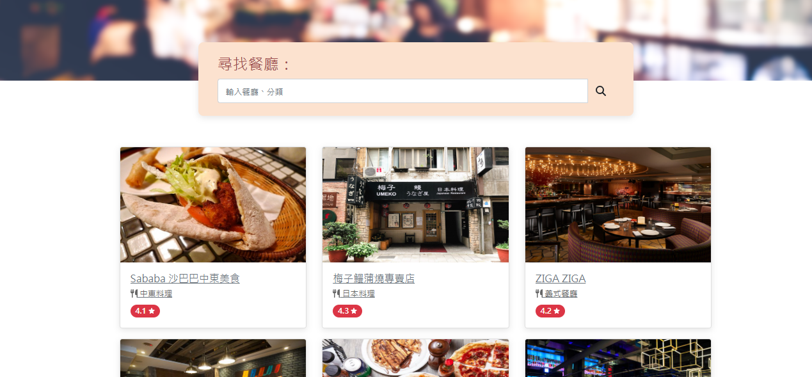

# 我的餐廳清單




## 介紹
AC 2-3 A1作業，可列舉餐廳菜單、顯示餐廳詳細資訊、連結至地圖等。


## 功能 
- 顯示所有的餐廳列表
- 顯示餐廳分類及評分
- 可搜尋特定餐廳名稱或分類
- 可瀏覽特定餐廳詳細資訊，包含類別、地址、電話、說明等
- 餐廳地址可連結到google地圖

## 開啟專案

1. 先下載專案至本地
2. 安裝node.js及npm
3. 透過終端機進入資料夾並輸入：

  ```bash
  npm run dev
  ```

4. 若看到此訊息則代表順利運行，打開瀏覽器進入到以下網址
  
  ```bash
  Listening on http://localhost:3000
  ```

## 待解決問題

.png)

如紅框圈選處，搜尋按鈕的樣式無法如css的設定顯示，開啟devtools並查看css設定的位置，不知為何被預設無法顯示，已自行查過可能問題或是換瀏覽器顯示，但是都無法解決，雖然並不影響搜尋功能，但尚未查出為何有此問題。

## 開發工具

- Node.js 18.16.0
- Express 4.16.4
- Express-Handlebars 3.0.0
- Bootstrap 5.1.3
- Font-awesome 6.4.0